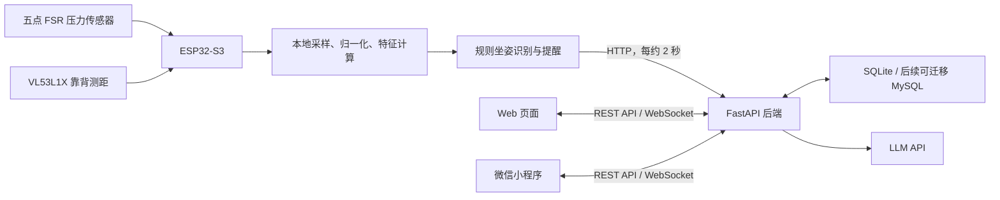

# SpineGuard 项目设计与现有逻辑

## 1. 项目概述

SpineGuard 是一个面向青少年坐姿行为监测、脊柱侧弯早期筛查参考和智能矫正提醒的物联网系统原型。系统通过坐垫上的五点 FSR 压力传感器采集坐姿数据，在 ESP32-S3 上完成预处理和初步坐姿识别，再将遥测数据发送到后端。

后端负责账号、学生、设备、遥测记录、统计、坐姿行为风险提示、报告、通知和游戏结算。Web 与小程序可通过统一 API 和 WebSocket 展示实时状态、历史趋势、报告、通知、管理员数据和种树游戏。

本项目输出的风险等级和建议只能作为坐姿行为风险提示或进一步筛查参考，不能作为医学诊断结果。

## 2. 总体架构



当前已经打通的主链路是：

```text
真实固件或模拟设备
→ HTTP 上传遥测
→ FastAPI 校验与落库
→ 统计、风险提示、报告和游戏结算
→ Web/小程序查询或接收实时推送
```

当前设备通信使用 HTTP，而不是最初规划的 MQTT。HTTP 已能满足现阶段原型联调和竞赛演示；后续如果设备规模扩大，可在保持业务数据格式基本不变的情况下增加 MQTT 接入层。

## 3. 仓库目录职责

```text
SG/
├─ backend/    FastAPI 后端、数据库模型、业务服务和测试
├─ firmware/   ESP32-S3 的 ESP-IDF 固件
├─ shared/     各端共同遵守的遥测 JSON Schema 和示例
├─ docs/       接口契约、已实现接口、数据库和遥测说明
├─ scripts/    模拟设备和辅助脚本
├─ web/        支持 Mock/真实 API 双模式的 Web 管理端
└─ miniapp/    微信小程序完整工程及云函数
```

Web 和小程序前端已经纳入本仓库统一维护。本文件只说明系统能够为前端提供的功能，不限定视觉设计或具体交互实现。

## 4. 硬件端设计与逻辑

### 4.1 五点压力采集

当前固件采集以下五个位置的 FSR 压力：

| 位置 | ESP32-S3 引脚 | ADC 通道 |
| --- | --- | --- |
| 左侧 `left` | GPIO4 | ADC1_CH3 |
| 右侧 `right` | GPIO5 | ADC1_CH4 |
| 前侧 `front` | GPIO6 | ADC1_CH5 |
| 后侧 `back` | GPIO7 | ADC1_CH6 |
| 中央 `center` | GPIO8 | ADC1_CH7 |

固件本地采样间隔约为 200 毫秒。每个位置进行 16 次 ADC 采样并取平均，以减小瞬时噪声。

### 4.2 原始值和归一化值

每次采样保留两组数据：

- `raw_pressure`：五个 ADC 原始值，范围 `0~4095`。
- `pressure`：通过各传感器的空载值和受压值标定后得到的归一化值，范围 `0~1000`。

原始值用于传感器标定、硬件排查和算法复核；归一化值用于坐姿判断、统计和界面展示。已有旧记录没有原始压力时，后端返回 `raw_pressure=null`。

### 4.3 压力特征计算

ESP32-S3 根据归一化压力计算：

- 五点总压力 `total_pressure`
- 左右压力差 `left_right_diff`
- 前后压力差 `front_back_diff`
- 横向压力中心 `center_x`
- 纵向压力中心 `center_y`
- 压力不对称指数 `asymmetry_index`

### 4.4 LightGBM 坐姿识别

当前固件在 ESP32-S3 上运行 LightGBM 模型。模型使用 20 帧窗口提取 38 维五区压力与靠背距离特征，输出：

```text
empty         无人
normal        标准坐姿
left_lean     左倾
right_lean    右倾
front_lean    前倾
back_lean     后倾
unknown       无法确定
```

模型识别来源标记为 `recognition_source=lightgbm`，模型版本为 `spineguard_lightgbm_fsr_tof_v2`。无人或模型结果不可用时可由规则输出 `empty/unknown`。模拟设备或 Web 测试数据必须标记为 `recognition_source=mock`。

### 4.5 靠背距离

固件已接入 VL53L1X ToF 测距传感器，通过 GPIO10/GPIO11 的 I2C 总线采集靠背距离。Telemetry 中的 `backrest` 会上报传感器在线、数据就绪、有效性、滤波距离和测距状态。距离无效时 `distance_mm=null`。

### 4.6 本地提醒

固件会跟踪当前坐姿持续时间。非标准坐姿连续约 30 秒后进入提醒状态并增加提醒次数。

当前已接入左、前、右、后四区 PWM 振动提醒硬件，可按异常方向定向振动。Telemetry 会返回振动总开关、免打扰后的实际开关、当前是否振动、振动位置、提醒冷却和电机健康状态。屏幕、指示灯和真实电量采集仍未完成。

### 4.7 联网与上传

ESP32-S3 连接 Wi-Fi 后通过 SNTP 同步时间。时间同步成功后，每约 2 秒向以下接口发送一条完整遥测：

```text
POST /api/v1/device/telemetry
X-Device-Token: <device_token>
```

当前协议版本为 V2，完整规则以 `shared/schema.json` 为准。每条遥测包括设备、会话、序号、时间戳、坐姿、两组压力值、压力特征、靠背距离、持续时间、真实振动状态、传感器健康、命令回执和版本信息。

当前 IMU 尚未接入，新固件可省略 `imu`。设备使用充电宝供电但无法测量剩余电量，因此 `battery_level=null`，前端不得显示为 0%。

## 5. 后端总体逻辑

后端使用 Python、FastAPI、Pydantic 和 SQLAlchemy。默认开发数据库固定为：

```text
backend/spineguard.db
```

当前使用 SQLite，适合单机开发和竞赛原型。后端通过 `DATABASE_URL` 支持以后切换 MySQL。若正式迁移到已有数据的 MySQL，应补充 Alembic 数据库迁移脚本。

### 5.1 遥测处理链路

后端收到一条遥测后依次执行：

1. 校验设备 Token。
2. 按 V2 Schema 校验字段、类型和数值范围。
3. 根据 `device_id` 查询当前有效学生绑定。
4. 将完整遥测写入 `posture_records`。
5. 更新设备在线状态、电量、固件版本和模型版本。
6. 以 `(device_id, session_id, seq)` 判断业务幂等。
7. 对首次收到的有效遥测执行游戏状态和奖励结算。
8. 向设备维度和学生维度 WebSocket 广播实时数据。

重复遥测可保留一致的接收结果，但不会重复计算提醒、时长、任务或奖励。乱序记录不会倒推已经完成的游戏结算。

### 5.2 账号与权限

系统使用一套账号体系供 Web 和小程序共同登录。登录成功后返回 JWT，后续请求携带：

```text
Authorization: Bearer <access_token>
```

当前角色包括：

| 角色 | 主要权限 |
| --- | --- |
| `parent` | 查看自己关联学生的数据、报告、通知和游戏状态 |
| `school_admin` | 查看学校管理数据、班级状态、风险学生和设备，执行导出 |
| `doctor` | 查看坐姿行为高风险提示学生和相关记录 |
| `admin` | 系统管理权限 |

家长只能访问自己通过 `user_student_links` 关联的学生。管理员和校医的接口仍会根据角色进行限制。

### 5.3 学生与设备绑定

- 学生使用匿名 `student_id` 和展示编号，不要求保存真实姓名。
- 每个学生同一时间只能绑定一个设备。
- 每个设备同一时间也只能有一个有效学生绑定。
- 用户换绑设备时，旧绑定会被标记为失效，再建立新绑定。
- 后续设备上传的数据会自动写入当前绑定学生的 `student_id`。
- 新固件登记后会保存六位绑定码哈希，换绑时必须校验正确的 `bind_code`。

### 5.4 实时状态和离线判断

后端提供设备维度和学生维度实时数据：

- REST 接口用于读取最新记录和历史记录。
- WebSocket 用于接收实时遥测和游戏事件。
- 后端重启导致内存最新数据为空时，会从数据库读取最后一条记录。
- 最后一次服务端收到遥测超过 10 秒，界面状态应显示离线。
- 从最后一条有效遥测开始满 5 分钟，后端结束本次设备会话。

设备离线期间不会累计标准坐姿时长、异常提醒、任务或成长奖励。

## 6. 数据统计逻辑

### 6.1 历史记录

可按学生或设备查询历史记录，并支持：

```text
from
to
limit
```

时间参数支持毫秒时间戳、自然日期或 ISO 时间。单次查询最多返回 2000 条记录。

### 6.2 会话级统计

统计会按 `session_id` 分组，并使用相邻遥测的时间差估算坐姿时长。这样可以避免直接累加设备反复上传的 `posture_duration_s` 导致重复计算。

当前统计内容包括：

- 标准坐姿时间和比例
- 左倾、右倾、前倾、后倾、未知状态的时间和比例
- 各类姿态出现次数
- 提醒次数
- 平均压力不对称指数
- 最长连续异常时间
- 姿态变化趋势

每个确认时间片最多按 10 秒计算，避免网络中断后把空档误算为持续坐姿。设备保持约 2 秒上传时，统计结果最稳定。

### 6.3 日统计和周统计

- 每日统计按北京时间自然日计算并保存到 `daily_stats`。
- 每周统计按自然周聚合。
- 日统计可重复请求，后端会更新同一学生同一天的统计结果。
- 没有有效遥测的数据周期不会生成虚假统计。

## 7. 坐姿行为风险提示

风险服务根据近期统计生成 `green`、`yellow`、`red` 三档坐姿行为风险提示，并返回：

- 风险分数
- 风险等级
- 风险原因
- 行为建议和进一步筛查参考

风险计算会参考压力不对称、异常坐姿时长、提醒情况和近期变化趋势。所有页面、报告和导出材料都不得将该结果表述为脊柱侧弯医学诊断。

## 8. 报告与 LLM 逻辑

### 8.1 用户主动生成智能报告

用户点击“生成报告”时，默认读取该学生最近 600 条坐姿记录，先由后端算法计算结构化摘要，再调用 `.env` 中配置的兼容 OpenAI `/chat/completions` 接口。

报告摘要包含：

- 标准坐姿时间和比例
- 各种非标准坐姿时间和比例
- 提醒次数
- 最长连续异常时间
- 姿态变化趋势
- 有针对性的行为建议

如果 LLM 未配置、超时或返回异常，后端自动生成规则兜底报告，已有统计结果不会丢失。

### 8.2 系统自动报告

系统后台自动按北京时间自然周期生成：

| 报告 | 统计周期 | 计划生成时间 |
| --- | --- | --- |
| 日报 | 上一个自然日 | 每天 00:10 |
| 周报 | 上一个自然周 | 每周一 00:20 |
| 月报 | 上一个自然月 | 每月 1 日 00:30 |

只有周期内存在坐姿数据的学生才会生成报告。每个学生、报告类型和周期具有唯一任务记录，防止重复生成。系统启动时可补偿最近遗漏的报告。

报告生成后，系统会自动创建一条 `report` 类型站内通知。用户在信息中心看到未读通知，查看后可标记为已读。当前不发送微信订阅消息、短信或邮件。

## 9. 种树游戏逻辑

游戏后端规则版本为 `garden-v1`。后端维护学生的成长值、阳光、水、养分、任务状态、连续标准坐姿时长和奖励流水。

### 9.1 实时规则

- 标准坐姿持续时间会进入连续计时。
- 非标准坐姿连续 30 秒触发一次提醒。
- 非标准坐姿连续 60 秒会清空连续标准坐姿时长。
- 恢复标准坐姿并稳定 5 秒后关闭本次异常片段。
- `empty`、`unknown` 和离线状态不累计标准坐姿时长。
- `unknown` 不作为明确的不良坐姿计算。
- 连续标准坐姿达到 5、15、30、45、60 分钟时实时发放对应资源。

### 9.2 每日成长

- 每天北京时间 20:00 根据当日有效标准坐姿时间发放基础成长。
- 基础成长按有效标准坐姿分钟计算，每日最多 180 点。
- 后端在 20:00 未运行时，会在下一次启动后幂等补发。
- 20:00 后到达、但属于原自然日的数据，会在后续补结算时继续占用原日期额度。

### 9.3 任务、资源和流水

当前支持：

- 每日标准坐姿任务
- 连续标准坐姿任务
- 提醒次数相关自动任务
- 久坐后主动离座相关自动任务
- 阳光、水和养分资源
- 晒太阳、浇水、施肥、修复树木操作
- 成长与资源流水查询
- 防重复领取和防重复操作的幂等键
- 游戏状态与奖励事件 WebSocket 推送

护脊运动由前端独立展示，不进入后端任务或奖励。15、30、45、60 分钟专注模式也只由前端实现倒计时，不改变树木成长、资源或后端统计。

## 10. 管理员能力

后端已经能够支持管理员实现：

- 学生数、设备数、在线设备数总览
- 平均标准坐姿率和高风险提示人数
- 班级列表及班级趋势统计
- 班级内匿名学生状态
- 高风险提示学生列表
- 设备在线状态查看
- 按时间范围导出匿名遥测数据
- CSV 和 Excel 导出
- 下载风险学生非正常坐姿记录 ZIP

风险学生 ZIP 解压后，每名学生对应一个 `{student_id}_{下载时间戳}.xlsx` 文件，表格中只包含其非正常坐姿记录。导出不包含设备 Token、学生姓名、手机号或真实班级信息。

## 11. 前端和小程序可达到的功能

正式前端可基于现有后端实现以下功能。

### 11.1 家长端

- 注册、登录、退出和个人账号信息
- 查看和更换学生绑定设备
- 查看设备在线状态、电量和版本
- 查看当前坐姿、识别置信度和提醒次数
- 展示五点归一化压力、ADC 原始压力和压力特征
- 基于五点压力制作坐垫热力图或 3D 压力效果
- 接收实时坐姿和压力变化
- 查询历史记录、每日统计、每周统计和趋势
- 查看绿色、黄色、红色坐姿行为风险提示
- 点击生成最近 600 条记录的智能报告
- 查看系统自动生成的日报、周报和月报
- 在信息中心查看未读通知并标记已读
- 查看树木成长、资源、任务和奖励流水
- 执行浇水、施肥、晒太阳和修复等游戏操作
- 在前端独立实现护脊运动和专注倒计时

### 11.2 学校管理员端

- 查看学校总体统计
- 查看活跃设备和离线设备
- 查看班级统计和匿名学生列表
- 查看高风险提示学生名单
- 查看单个学生的历史、统计、风险提示和报告
- 导出 CSV、Excel 和风险学生 ZIP
- 创建站内通知

### 11.3 校医端

- 查看高风险提示学生名单
- 查看有权限的匿名坐姿记录和风险信息
- 下载风险学生非正常坐姿记录
- 将结果作为进一步筛查参考，不作医学诊断

## 12. 主要数据库设计

数据库按业务分为以下几组。

### 12.1 账号和设备

```text
users
students
user_student_links
devices
device_bindings
```

### 12.2 遥测和分析

```text
posture_records
daily_stats
risk_assessments
reminder_events
telemetry_receipts
```

`posture_records.id` 是正式整数主键。在 SQLite 中它同时是内部 `ROWID` 的别名；以后迁移到 MySQL 时应继续使用 `id`，不要依赖 `ROWID`。

### 12.3 报告和通知

```text
reports
scheduled_report_runs
notifications
```

### 12.4 游戏

```text
device_session_states
abnormal_episodes
growth_settlement_segments
garden_accounts
game_daily_progress
reward_ledger
milestone_claims
daily_task_states
idempotency_records
```

## 13. 部署与联调方式

项目不要求所有部分运行在同一台电脑上。推荐在同一个局域网中：

1. 一台电脑运行 FastAPI 后端和唯一的开发数据库。
2. ESP32-S3 将上传地址配置为后端电脑的局域网 IP。
3. 前端同学在另一台电脑运行 Web，并把 API 地址配置为后端电脑 IP。
4. 小程序开发工具同样请求该后端地址。
5. 后端电脑允许局域网访问 8000 端口。

示例：

```text
后端：http://192.168.1.20:8000
API：http://192.168.1.20:8000/api/v1
文档：http://192.168.1.20:8000/docs
```

前端和设备不应直接连接或修改数据库，所有数据都应通过后端 API 访问。这样账号权限、数据校验、统计和游戏结算逻辑才能保持统一。

当前后端允许跨域请求，便于局域网联调。正式部署时应将跨域来源限制为实际 Web 域名，并使用 HTTPS、更换开发密钥和设备 Token。

## 14. 当前完成度与边界

### 14.1 已基本完成

- 统一遥测 V2 协议
- 五点归一化压力和 ADC 原始压力上传、落库和查询
- 账号认证和角色权限
- 学生、设备和一对一绑定
- 实时遥测、历史记录和 WebSocket
- 日统计、周统计和会话级时长估算
- 坐姿行为风险提示
- 主动智能报告和 LLM 规则兜底
- 自动日报、周报、月报和站内通知
- 管理员总览、班级、高风险列表和数据导出
- 种树游戏账户、任务、资源、结算、流水和实时事件
- SQLite 无损字段升级和后端自动建表

### 14.2 仍需完善

- 接入并标定真实五点 FSR 坐垫
- 按需要评估接入 MPU6050/BMI270 等 IMU
- 接入屏幕和指示灯
- 接入真实电池电量检测
- 使用真实采集数据调整坐姿阈值
- 继续收集标注数据并优化现有 LightGBM 模型
- 完成正式 Web 和小程序的视觉与交互实现
- 增加生产环境部署、安全配置和数据库备份
- 数据规模扩大后迁移 MySQL，并引入 Alembic
- 如设备规模扩大，再评估 MQTT 接入

## 15. 统一规则与协作约束

- 修改遥测字段时，必须同步更新 `shared/schema.json`、后端模型、Web 类型、小程序解析和固件结构。
- 模拟数据必须标记 `recognition_source=mock`。
- 不向 GitHub 提交 Wi-Fi 密码、JWT、设备 Token、LLM 密钥、学生姓名、手机号或真实班级信息。
- 风险结果只能表述为坐姿行为风险提示或筛查参考。
- 后端修改后运行 `pytest`。
- Web 修改后运行 `npm run build`。
- 固件修改后在 ESP-IDF 环境运行 `idf.py build`。

## 16. 关键文档入口

```text
shared/schema.json                         遥测机器校验协议
shared/example.json                        遥测完整示例
docs/telemetry-contract.md                 遥测字段说明
docs/api-contract.md                       总体接口契约
docs/implemented-api.md                    当前已实现接口
docs/database-design.md                    数据库设计
backend/README.md                          后端运行和功能说明
backend/REPORT_AND_NOTIFICATION_GUIDE.md   智能报告和自动通知说明
backend/RAW_PRESSURE_V2_CHANGELOG.md       原始压力与 V2 升级说明
```
